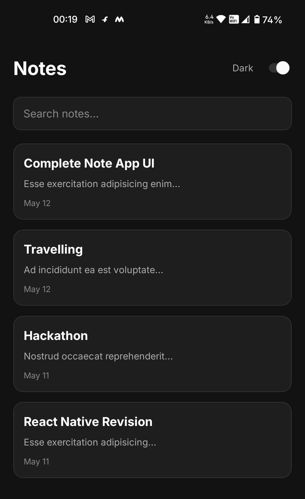
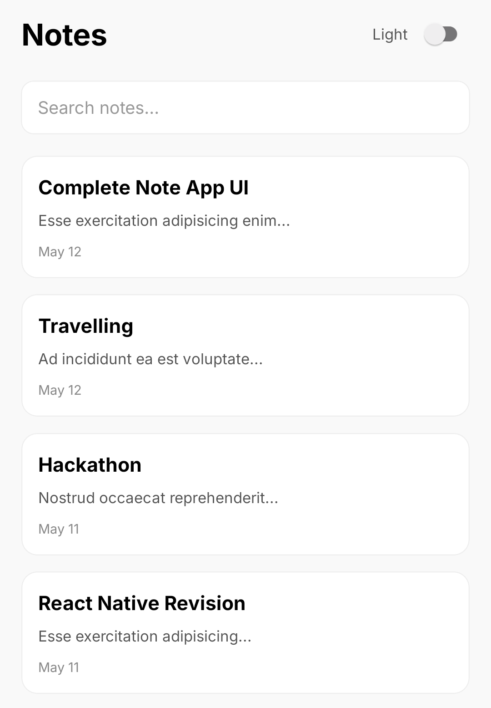
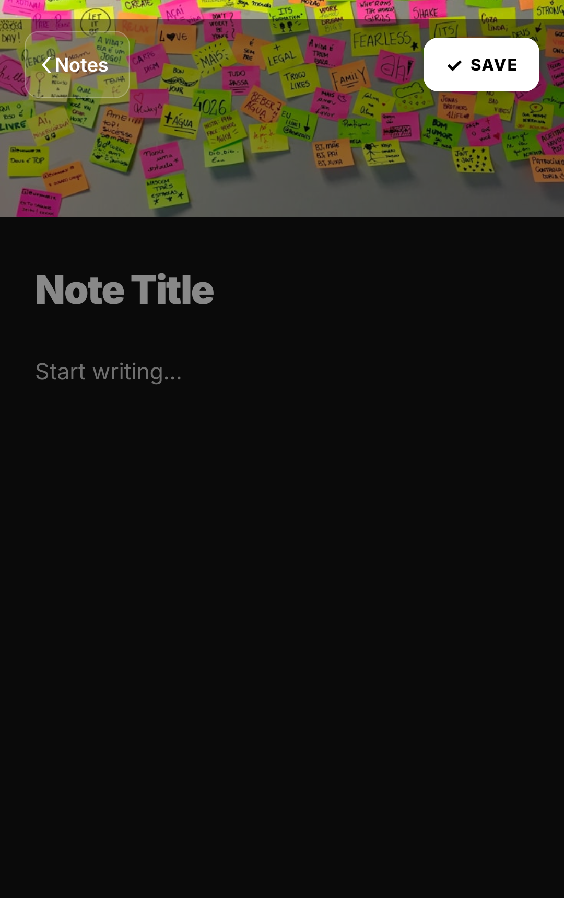

# Assignment : Notes App by Chaicode (React Native Cohort)

A clean and responsive Notes App UI built using React Native and Expo.

## Preview





## Demo Video

▶️ [Watch Demo Video](https://youtube.com/shorts/MoxilS9bbUQ)

## Features

- Notes listing screen using `FlatList`
- Search notes with `TextInput`
- Dark/Light mode support using `useColorScheme()`
- Responsive layouts using `useWindowDimensions()`
- Note editor screen with multiline inputs
- `KeyboardAvoidingView` support
- `ImageBackground` header section
- Reusable buttons using `Pressable`
- Clean styling with `StyleSheet.create()`
- Usage of `StyleSheet.compose()` / `StyleSheet.flatten()`

---

## Screens

### Notes Listing Screen

- Displays notes in a scrollable list
- Search/filter functionality
- Theme toggle support
- Structured note cards with title, preview, and timestamp

### Note Editor Screen

- Create/Edit note UI
- Title and content input fields
- Save and Back buttons
- Keyboard-friendly layout

---

## Tech Stack

- React Native
- Expo
- JavaScript / TypeScript

---

## Installation

```bash
npm install
```

## Run the Project

```bash
npx expo start
```
